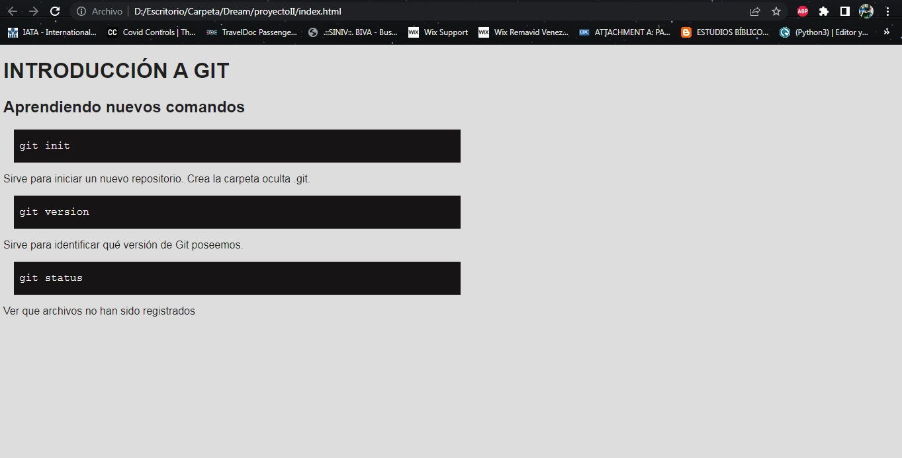

<h1 align="center"> APRENDIENDO GIT </h1>

 

   
   

**Índice**
1. [Descripción del proyecto](#id1)
2. [Estado del proyecto](#id2)
3. [Características de la aplicación](#id3)
4. [Tecnologías utilizadas](#id4)
5. [Agradecimientos](#id5)
6. [Autora](#id6)
7. [Licencia](#id7)

<h2>Descripción del proyecto</h2>

Se trata de una breve reseña de comandos básicos de uso de Git.

<h2>Estado del proyecto</h2>

Estamos en fase de desarrollo.

<h2>Características de la aplicación</h2>

Despliega a modo educativo algunos comandos básicos de Git.

- `Funcionalidad 1`: Recordar un poquito HTML y CSS
- `Funcionalidad 2`: Aprender Git

<h2>Tecnologías utilizadas</h2>

- `HTML`
- `CSS`

<h2> :+1: Agradecimientos</h2>

[Shields.io](https://shields.io/) Apoyo para crear el  Readme

<h2> :smiley: Autora</h2>

 [Daniela González.](https://github.com/danyhoshi)

<h2> :unlock: Licencia</h2>
Este proyecto tiene licencia MIT licensed.

